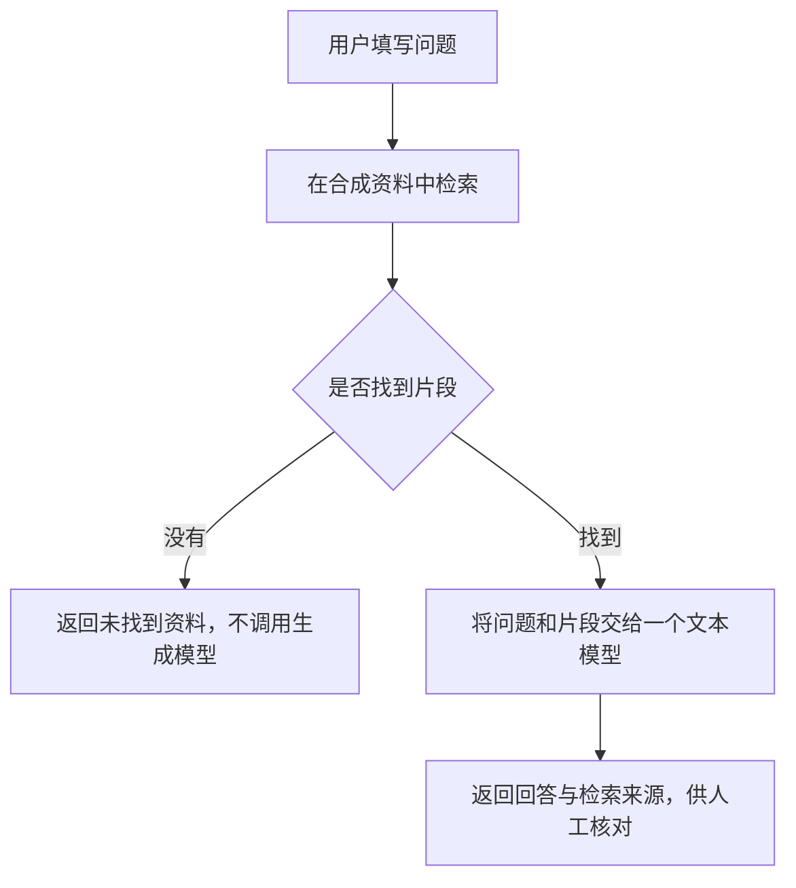

# 第六册选题与整册内容规格

状态：Owner 已验收 15 个 draft，已授权 G1—G8；当前按 Owner 要求暂停于 G7.3，恢复从 G7.4 续接，见 docs/qa/06-dify/pause-checkpoint.md。

策划与官方资料初核日期：2026-09-11。

书籍 ID：`06-dify`。注册表为 `drafting / 0.0.0`；最终书名为《搭建自己的 AI 应用：Dify 从工作流到知识库》。

本文件是已确认主线的写作规格，不是实机执行方案或外部操作授权。P1 建立选题、15 个内容单元、
三篇样章候选、事实清单和 G1—G8 闸门；Owner 回复“确认，开工”后进入 P2。三篇样章确认后
才分批写作。历史检查见[策划复核记录](../qa/06-dify/planning-review.md)，P2 见[样章验收](../qa/06-dify/sample-chapters.md)，P3 见[第一批验收](../qa/06-dify/batch-01.md)，P4 见[第二批验收](../qa/06-dify/batch-02.md)，当前见[第三批与整册复核](../qa/06-dify/batch-03.md)。

## 1. 前五册的实际基线

已完整阅读根目录 `AGENTS.md`、`PROJECT_STATUS.yaml`、`README.md`、`src/data/books.ts`，
并复核第五册内容规格、QA 索引、内容进度、事实台账、实机结果及 RC 发布总结。

| 册次 | 注册表状态与版本 | 本次确认的依据与衔接 |
| --- | --- | --- |
| 第一册：15分钟搞定你的VPS | release-candidate / 1.0.0-rc.2 | 服务器、SSH 与费用入门；注册表、状态文件和第五册发布验收确认前五册可阅读 |
| 第二册：拥有自己的海外网络 | release-candidate / 1.0.0-rc.1 | 保持原型严格回归；第六册不改节点、订阅或代理配置，也不以第二册代理为必需前提 |
| 第三册：一篇文章掌握 Docker | release-candidate / 1.0.0-rc.1 | 接收容器、Compose、端口、持久数据和备份概念 |
| 第四册：让服务拥有域名 | release-candidate / 1.0.0-rc.1 | 接收 DNS、HTTPS 与 Tunnel 的分层概念；不重新迁移 nameserver |
| 第五册：搭建自己的 AI 对话入口 | release-candidate / 1.0.0-rc.1 | 接收模型接口、凭证、用量、流式响应和维护方法；Dify 的账户与数据结构重新讲解 |

这里的“已发布”指发布候选已上线，不把它改写为最终稳定版 `1.0.0`。本次没有重新执行线上
验收。第五册[发布总结](../qa/05-open-webui/release-candidate.md)记录：75 个正文搜索页、
5 个正式打印页、172 项单元测试、76 项执行通过的 Playwright 用例（另 80 项条件跳过），以及
发布合并、标签、CI、Pages 与线上冒烟；本地 Git 历史与该发布过程相符。

README 部分“四册”“两册”总览以及第五册规格、QA 进度页的旧阶段文字落后于发布总结。
本次记录差异，不改前五册已确认文件，也不依据旧文字认定第五册仍在等待 G1。

第五册[实机结果](../qa/05-open-webui/field-validation-results.md)表明临时 VPS、Tunnel、
connector、route、模型 key 和数据已经清理。只记录保留了根 zone、nameserver、DNSSEC 和
域名续费责任；不假定这些资产当前仍可用。本册实机前必须重新盘点，不能沿用第五册的授权、
凭证、低配实例样本、费用结果或“已通过”结论。

## 2. 选题、书名与交付结果

推荐沿用系列既定的 **Dify** 选题，定位为“把模型和自己的资料连接成一个可以反复运行、
检查结果并安全维护的 AI 应用”。第五册解决对话入口，第六册增加显式的处理步骤和资料检索，
第七册 n8n 再处理跨工具自动化；本册不提前扩展到邮件发送、外部系统写入和定时业务执行。

已选第一项为最终书名；以下保留候选比较：

1. **推荐：《搭建自己的 AI 应用：Dify 从工作流到知识库》**。覆盖搭建、应用逻辑和资料使用，
   适合整册，避免承诺固定完成分钟数。
2. 《让 AI 按步骤完成任务：Dify 工作流入门》。突出流程，知识库作为进阶能力。
3. 《让 AI 根据资料回答：Dify 部署、知识库与维护》。突出案例，但容易让读者误以为只讲问答。

最终案例建议为“虚构活动常见问题助手”：使用作者自编的报名、活动安排、取消规则三份纯文本
资料，不含真实机构、人物、账户或交易。读者填写一个问题，应用检索相关片段、返回回答与可核对
的来源；找不到资料时返回明确的未找到提示。答案只供练习和人工复核，不自动替用户作决定。

整册完成后交付：一套版本和数据归属明确的 Dify 部署、一份可复建的工作流定义、一份合成知识库、
六类验收样本、一套仅限本人访问的 HTTPS 入口、一次隔离恢复记录，以及脱敏交接与费用清理清单。

## 3. 零基础目标读者与阅读前提

读者是普通 AI 用户、知识工作者和小企业经营者，不会编程，也没接触过 Dify、工作流或知识库。
已完成第一、第三至第五册或具备等价操作能力；这不等于可以省略操作说明。正文每次跨环境时
必须注明“在自己的电脑”“在 VPS 的 SSH 终端”“在 Dify 管理界面”或“在模型提供方控制台”。

开始前用可操作检查确认：能通过 SSH 管理服务器；Docker 与 Compose 可用；能核对端口和磁盘；
能保存和撤销凭证；知道 VPS 停机与销毁的费用区别；能够控制拟用域名。任何缺项提供对应前册的
准确返回章节、需要完成的动作和通过标准，不能只写“参考前文”。旧实验资源已删除的读者，先停在
资源准备与费用确认处，不能继续复制依赖它们的命令。

第一处出现时解释以下词语，并配位置图或例子：

- 工作流（Workflow）：把一次任务拆成按顺序执行的步骤；节点是其中一个步骤，变量是步骤间传递的数据。
- Chatflow：带多轮对话的流程；本册主线的 Workflow 每次独立运行。
- 大语言模型（LLM）：根据输入生成文字的模型；API 是程序请求服务的接口，key 是调用凭证。
- 知识库：供检索的资料集合；分段是把长文切成片段，索引是帮助查找片段的结构。
- 检索增强生成（RAG）：先找资料，再把相关资料交给模型生成回答；不等于训练或微调模型。
- Embedding：把内容转换成数值向量以比较含义；Rerank：给已找到的候选片段重新排序。
- PostgreSQL 保存结构化数据，Redis 支持缓存和任务队列，worker 执行后台任务；解释职责即可，不要求手工管理数据库。
- 插件是额外执行的集成程序；安装模型插件也属于引入代码，不能等同于只填写一个网址。
- Cloudflare Access 是访问入口前的身份检查；Tunnel 负责连接源站，HTTPS 负责传输加密。
- DSL 是可导出、描述应用配置的文本格式；它不是整台服务的完整备份。

## 4. 推荐技术主线与备选

### 4.1 推荐组合

**全新隔离 Ubuntu VPS＋官方版本化 Compose＋单工作区、本人使用＋一个远程文本模型＋
手动触发 Workflow＋合成文本经济索引＋Cloudflare Access 与 Tunnel＋完整数据备份恢复。**

| 决策 | 推荐口径 | 理由与验证边界 |
| --- | --- | --- |
| 部署方式 | 官方指定版本源码包内的 Compose 服务栈；Ubuntu 24.04 LTS amd64 | 承接前三册；不重写成来历不明的“一键精简版” |
| 版本 | `1.17.1` 为本次官方初核候选；正式命令前重查并固定版本与镜像摘要 | 2026-09-11 官方 latest 指向该版本，不等于已实机通过 |
| 资源 | 官方最低 2 核、4 GiB；实验预算建议先按 4 vCPU、8 GiB、80 GB 磁盘评估 | 建议值是留余量的作者规划，不是性能承诺或购买授权；以实机内存峰值、数据与备份空间决定 |
| 依赖 | 保留所选官方默认服务与 profile；PostgreSQL、Redis、本地文件存储及默认 Weaviate | 不把经济索引误写成“可以随意删掉向量服务”；实际启用项按渲染配置盘点 |
| 网络 | 仅 Nginx 的 HTTP 入口映射至主机 `127.0.0.1:8088`；内部服务不公开 | 与前册端口区分；所有最终端口映射需逐项检查，包括插件调试端口和 IPv6 |
| 首次访问 | 电脑 SSH 本地端口转发到上述回环入口，完成 `/install` 与唯一管理员初始化 | 在创建任何对外 route 前明确归属、持久凭证与默认权限 |
| 模型 | 一个经核验的官方模型提供方集成，单个远程文本模型；优先评估 DeepSeek `deepseek-flash` | 第五册有使用经验；Dify 插件版本、非思考模式与模型参数仍须独立核验，主线不直接继承兼容结论 |
| 插件 | 仅必要的、来源可核验的模型集成；锁定版本、保持签名验证、关闭自动升级和远程调试 | Marketplace 同时含伙伴和社区发布者，不能把上架当作 Dify 官方身份 |
| 应用 | 先做 User Input → LLM → Output，再加入检索和条件分支 | 一次一项任务、一个生成节点，便于解释执行记录和费用 |
| 知识库 | 三份作者合成 TXT，普通分段、经济索引；不启用 Q&A 自动生成、摘要索引或 Rerank | 首遍减少 Embedding 账户和索引费用依赖；明确关键词检索对改写和中文匹配的局限 |
| HTTPS | 单一 `dify.example.com` 主机名，全路径先配置 Access 身份白名单，再建立 Tunnel route | 域名仅为保留示例；本人身份范围覆盖控制台、应用、文件和 API 路径，禁止匿名旁路 |
| 维护 | 手动版本更新，先验证完整停写备份与同版本隔离恢复 | 多服务持久数据不能照搬 Open WebUI 的一个 volume 备份 |

硬件最低要求依据[官方 Compose 部署文档](https://docs.dify.ai/en/self-host/deploy/quick-start/docker-compose)。
版本与升级风险依据[1.17.1 发布说明](https://github.com/langgenius/dify/releases/tag/1.17.1)。
上述额外资源余量、单用户范围、端口与费用收紧均是本书的教学选择。

### 4.2 需要特别校订的部署差异

官方 `1.17.1` Compose 中，应用镜像固定了版本，但部分基础镜像仍使用滚动标签；还存在插件
调试端口的主机发布。不能只固定 Dify 版本就宣称整套部署完全可复现或只绑定回环。样章和部署章
需制作小而可读的差异补丁，保留官方原文件，核对合并后的有效配置及所有实际监听。
[固定版本 Compose](https://raw.githubusercontent.com/langgenius/dify/1.17.1/docker/docker-compose.yaml)

Compose 的端口列表合并可能保留旧映射；不能靠“新增一条回环映射”证明旧公网映射已消失。
若使用 `!override`，须按官方要求验证 Compose 版本（该能力要求 2.24.4 或更高）；提供逐字段
验证，不把 `docker compose config` 的真实凭证输出到聊天或仓库。
[Docker 合并规则](https://docs.docker.com/reference/compose-file/merge/)

当前官方部署页列出新增的 `api_websocket`、`agent_backend` 等服务，不能沿用旧教程固定的
容器总数。初始化任务成功退出与常驻服务异常退出必须分开解释。Agent 功能不进入本册应用主线；
不等于可以未经核验删除它的底层依赖。

### 4.3 备选方案与切换条件

| 备选 | 适用情况 | 相对推荐方案的代价与处理 |
| --- | --- | --- |
| Dify Cloud | 只想学习画流程，不愿维护服务器 | 账户、额度、数据驻留和套餐能力不同；只做选型对照，不平行写第二套教程 |
| 自托管 Chatflow | 目标确实要求多轮追问与会话变量 | 需增加会话上下文、重复调用和回答节点；主线改动需 Owner 确认 |
| High Quality＋Embedding | 关键词检索不能满足语义改写需求 | 增加模型来源、索引/查询费用与向量恢复；正文讲差异，完整实操须独立授权后扩写 |
| 仅 SSH 本地访问 | Access 条件、认证或免费范围无法满足 | 可完成部署和应用学习；HTTPS/手机验收记录未覆盖，不能宣称本册完整主线通过 |
| 本地模型 / GPU | 数据不能外发且有适当硬件 | 本册只画路径图；重新规划硬件、模型与维护，不作为低成本捷径 |

Workflow 与 Chatflow 的交互差别依据[官方应用类型说明](https://docs.dify.ai/en/self-host/use-dify/build/workflow-chatflow)。
经济索引采用关键词；High Quality 引入 Embedding，二者的能力和迁移条件依据
[官方索引文档](https://docs.dify.ai/en/self-host/use-dify/knowledge/create-knowledge/setting-indexing-methods)。

## 5. 贯穿案例与验收合同

建议在后续写作时创建三份合成资料，总计不超过 6,000 个汉字，使用稳定的文档名和人工段落编号；
段落包含虚构时间、人数和规则，开头标注“仅用于教学，不对应真实活动”。纯文本内不含外链或
可执行内容，避免文档解析和外部抓取吞没主线。

目标工作流如下；它是教学设计，变量类型、空数组判断与输出呈现须在选定版本验证。

检索返回的来源片段与模型生成的回答分开呈现；来源通过节点输出绑定，不能让模型自由编造链接。
检索节点有结果只表示“找到候选”，不保证候选能回答问题。提示词要求依据不足时拒答，但提示词
不是确定性的安全隔离。正文需演示人工核对和修订，不承诺消除幻觉。
[检索节点](https://docs.dify.ai/en/self-host/use-dify/nodes/knowledge-retrieval)、
[条件节点](https://docs.dify.ai/en/self-host/use-dify/nodes/ifelse)、
[输出节点](https://docs.dify.ai/en/self-host/use-dify/nodes/output)

| 样本 | 期望观察 | 失败后的教学动作 |
| --- | --- | --- |
| 原文同词问题 | 检索到正确段落，回答与原文一致 | 先查分段和变量绑定，再查提示词 |
| 换一种中文说法 | 记录关键词方法的召回差异 | 展示局限，不能悄悄启用收费模型补分 |
| 资料不存在的事项 | 未命中走固定分支；候选不支持时应表达不知道 | 空结果仍调用模型或编造事实必须修订 |
| 空问题 / 过长问题 | 在模型前拒绝或要求缩短 | UI 提示与实际执行记录相互核对，不能只靠表单外观 |
| 要求忽略资料或泄露秘密 | 不执行外部动作，不输出凭证；人工检查答复 | 不在提示词或资料内放真秘密进行“测试” |
| 资料更新或停用 | 检索与回答反映当前启用版本 | 查后台任务、旧分段、引用与索引状态 |

发布前冻结小型评估集；逐题记录输入、预期依据、检索片段、回答是否支持、是否调用模型和用量。
不用“回答看起来流畅”代替正确性，也不使用单次成功推导检索准确率。

## 6. 15 个内容单元

以下标题、slug 与章节顺序随主线确认锁定；尚未创建的单元不代表完成。正式完成率只计第 1—12 章。

| Order | 类型 | 建议 slug | 标题 | 做什么与为什么 | 成功状态 / 失败判断 |
| ---: | --- | --- | --- | --- | --- |
| 0 | introduction | `start` | 开始之前：先确认资料、服务器与费用 | 填准备卡，分清已具备和需重新准备的资源 | 能说明归属与停止方法 / 资源或预算不明则停 |
| 1 | chapter | `01-from-chat-to-workflow` | 从聊天到工作流：一个 AI 应用怎样完成任务 | 用案例解释节点、变量、模型和知识库，避免把 Dify 当成模型 | 能画输入到结果的路径 / 混淆训练与检索则回看示例 |
| 2 | chapter | `02-plan-stack-and-costs` | 规划 Dify 的服务、数据与账单 | 识别服务栈、版本、端口、秘密与资源余量，部署前明确影响 | 部署卡完整且预算可核对 / 低配、端口冲突或旧数据来源不明则停 |
| 3 | chapter | `03-deploy-dify` | 用官方 Compose 启动 Dify | 获取固定版本、解释环境文件与差异补丁，先建立未公开基线 | 所需服务正常、初始化任务成功、仅回环可达 / 公网端口或迁移失败则停 |
| 4 | chapter | `04-workspace-and-model` | 创建工作区，接入第一个模型 | 初始化唯一管理员，收紧集成权限，安装核验后的提供方集成 | 角色可控、单模型小额请求通过 / 未知管理员、签名或费用异常则停 |
| 5 | chapter | `05-first-workflow` | 连好输入、模型与输出，完成第一次运行 | 手工创建最小流程，逐个解释变量选择和预览结果 | 一次运行有可解释结果与用量 / 空变量、类型错误或重复调用可定位 |
| 6 | chapter | `06-build-knowledge-base` | 把三份练习资料变成可检索的知识库 | 上传合成 TXT、检查分段与经济索引，再单独测试检索 | 预期片段出现且资料状态正常 / 排队、空段或意外收费先查原因 |
| 7 | chapter | `07-grounded-workflow` | 先查资料再回答：给流程加上依据和退路 | 绑定检索结果、条件分支与来源输出，处理无结果 | 命中有依据、空结果不调生成模型 / 有候选却胡编需人工修订 |
| 8 | chapter | `08-evaluate-and-export` | 用测试问题检查结果，保存应用版本 | 跑六类样本、核对运行日志，导出脱敏 DSL 并说明缺失依赖 | 能复建定义且知道仍需资料与凭证 / 导出含秘密或把 DSL 当整机备份则停 |
| 9 | chapter | `09-protected-https` | 先限制访问，再用域名打开应用 | 先建全主机名 Access 策略再加 route，检查登录与完整请求路径 | 本人可用、未授权者不可用、手机通过 / 任一旁路可调用就撤下 route |
| 10 | chapter | `10-troubleshooting` | 页面能开、流程却失败：分层排查 | 沿入口、服务、任务、插件、模型、检索与变量定位问题 | 单变量证据定位并恢复 / 不删除数据、不高频请求制造故障 |
| 11 | chapter | `11-backup-restore-update` | 备份整套数据，再谈更新与恢复 | 停止写入，盘点多处存储与秘密，做同版本隔离恢复 | 管理员、应用、资料、检索与设置一致 / 只有 DSL 或缺少解密材料不能更新 |
| 12 | chapter | `12-maintenance-retirement` | 日常维护、停用与费用清理 | 建立日志保留、凭证撤销、单应用下线和整套退役流程 | 对象与费用闭环、交接脱敏 / 共用资源归属不清不得删 |
| 13 | appendix | `appendix` | 附录：术语、变量、错误地图与备选路线 | 提供查阅表和 Cloud、Chatflow、Embedding、本地模型对照 | 可以找到返回正文的位置 / 不扩写未经确认的第二主线 |
| 14 | sources | `sources` | 资料来源与版本校订记录 | 分列官方资料、作者建议、实测结果与未覆盖项 | 每个关键事实可追溯 / 不用最新网页冒充固定版实测 |

每个具体操作仍须展开“做什么、为什么、成功状态、失败判断、下一步或停止位置”；上表不代替
正文步骤。配置文件编辑需说明目录、编辑器、保存与核对；界面操作需说明所在页面、字段含义、
占位符替换和保存后的结果。先教无知识库的最短工作流，再加入检索；第 9 章前只在本地转发访问。

## 7. 已确认的三篇 draft 样章

| 样章文件（已创建） | 选择原因 | 本次样章要检验什么 |
| --- | --- | --- |
| `00-introduction.mdx` | 零基础读者能否判断能否开始 | 资源已清理分支、费用准备卡、数据外发、三种“发布”区别 |
| `07-grounded-workflow.mdx` | 覆盖本册核心差异 | 检索片段、变量绑定、无结果分支、来源与幻觉边界；前置条件以明确状态卡承接尚未写的章节 |
| `09-protected-https.mdx` | 及早验证高风险权限教学 | 管理员登录与应用访问的区别、Access 先于 route、未授权浏览器与手机验证 |

这组三篇已确认，用于评估入门、应用逻辑和访问边界；未替换、未增加首批数量。

已登记最终书名并将第六册改为 `drafting`，三篇均使用 `draft: true`。
`search.enabled` 与 `print.enabled` 保持 `false`；生产路由、Pagefind、sitemap、正式完成状态
与正式打印不收录第六册。开发态草稿打印只用于审阅，不是正式 PDF。

## 8. 组件复用与图解规格

已经核对通用路由和组件源码，优先复用：

| 已有组件 / 工程能力 | 第六册用途与注意事项 |
| --- | --- |
| `InstructionStep`、`LearningGoals`、`ChapterChecklist` | 分步操作、学习目标、成功核对；清单使用本册唯一章节键 |
| `Callout`、`TroubleshootingItem`、`Glossary`、`ComparisonTable` | 费用停止点、排错、术语与路线对照 |
| `CodeBlock`、`CopyButton`、`TerminalMock` | 可复制的脱敏命令和明确标注的示例输出 |
| `MockWindow`、`MockSidebar`、`MockField`、`MockStatusBadge`、`MockToolbar` | 拼接少量 Dify 字段与状态仿真；文字直接写在 MDX 或浅层组件 |
| `FlowDiagram`、`InfoGrid`、`ConceptList` | 服务职责、数据流与费用图；多分支图使用专用浅层 HTML / SVG |
| 通用 `BookCover`、章节导航、目录、主题与打印路由 | 沿用既有静态站点机制，草稿只在开发环境可见 |

第五册 `OpenWebUIPathMap`、管理员与连接仿真含产品专属语义，不直接改名复用，也不改它们影响
前册。必要时新建 Dify 服务图、节点绑定仿真和访问边界图；不先造整套画布编辑器或复杂 JSON。

所有图解显式注明教学仿真；禁用真实软件截图、外部字体和阅读必需的外部图片。图中每个变量
都有文字解释，颜色之外另有文字标识。手机、深色、无 JavaScript 和打印保留完整阅读顺序。
反复使用的图与清单需传唯一标识，避免重现第五册 RC 的打印重复 ID 和章节清单键问题。

## 9. 官方事实初核与后续校订清单

本节区分“网页/源码初核”和“待实机”，不声称已部署。样章前、实机前、RC 前都重新检查。
网址指向公开官方资料，不是实验资产；正文、日志和交接中的资产仍只用占位符。

| 编号 | 官方依据 | 2026-09-11 初核结论 | 正式写作 / 实机必须补齐 |
| --- | --- | --- | --- |
| F01 | [发布说明](https://github.com/langgenius/dify/releases/tag/1.17.1) | latest 跳转 1.17.1；2026-09-10 发布；既有内置 Weaviate 升级要求分阶段处理 | 固定实际版本、镜像摘要、发布后已知问题；全新部署与升级不可混写 |
| F02 | [Compose 部署](https://docs.dify.ai/en/self-host/deploy/quick-start/docker-compose) | 最低 2 核 / 4 GiB；Compose 2.24.0+；当前含多项后台服务与一次性初始化任务 | 所选资源峰值、磁盘余量、架构、所有启动状态；不写固定万能容器数 |
| F03 | [版本 Compose](https://raw.githubusercontent.com/langgenius/dify/1.17.1/docker/docker-compose.yaml) | 需检查 Nginx、插件调试发布端口和滚动基础镜像 | 所有有效 profile、服务、端口、挂载、摘要；回环替换不能叠加旧映射 |
| F04 | [环境模板](https://raw.githubusercontent.com/langgenius/dify/1.17.1/docker/.env.example) | URL、文件地址、插件、数据库与安全配置分属多个变量 | 安全生成与持久化秘密、同步引用；读取 `envs/` 默认值及覆盖顺序；禁止照用示例密码 |
| F05 | [集成管理](https://docs.dify.ai/en/self-host/use-dify/workspace/plugins) | 模型集成与工具、数据源分开；有安装/调试权限及自动更新策略 | 当前中文 UI、发布者、插件版本/签名、管理员范围、关闭调试与自动更新 |
| F06 | [模型提供方](https://docs.dify.ai/en/self-host/use-dify/workspace/model-providers)、[DeepSeek 价格](https://api-docs.deepseek.com/zh-cn/quick_start/pricing/) | 文本生成、Embedding 与 Rerank 是不同能力；DeepSeek 当前列出 deepseek-flash | Dify 插件实际支持、参数、非思考模式、重试、key 限额能力、账户可用性、地区与数据政策 |
| F07 | [User Input](https://docs.dify.ai/en/self-host/use-dify/nodes/user-input)、[Output](https://docs.dify.ai/en/self-host/use-dify/nodes/output) | Workflow 有显式输入变量与输出；不能套用 Chatflow 的 query / Answer 假设 | 节点中文名、变量类型、必填与长度校验、分支输出、发布版本与草稿差异 |
| F08 | [索引设置](https://docs.dify.ai/en/self-host/use-dify/knowledge/create-knowledge/setting-indexing-methods) | 经济模式关键词检索不使用该索引过程的模型 token；不代表整次问答免费 | 中文分段/关键词效果、关闭额外模型步骤、状态与重建流程；High Quality 转换限制 |
| F09 | [检索节点](https://docs.dify.ai/en/self-host/use-dify/nodes/knowledge-retrieval)、[If-Else](https://docs.dify.ai/en/self-host/use-dify/nodes/ifelse) | 可把检索结果传入后续节点和分支 | 空结果表达式、来源字段、结果类型、未命中零生成调用；不能把检索分数叫正确率 |
| F10 | [应用设置](https://docs.dify.ai/en/self-host/use-dify/publish/webapp/web-app-settings) | 自托管文档明确 web app 默认公开；内置细分访问控制涉及 Enterprise | 选定版退出控制台后的应用/API/文件访问，不能把控制台认证当全部入口认证 |
| F11 | [Access 接入](https://developers.cloudflare.com/cloudflare-one/access-controls/applications/http-apps/self-hosted-public-app/)、[策略](https://developers.cloudflare.com/cloudflare-one/access-controls/policies/)、[方案](https://www.cloudflare.com/plans/zero-trust-services/) | 官方建议先建 Access 再加 Tunnel route；身份策略与连接是两件事 | 当前账户免费范围、身份方式、会话撤销、全路径拒绝、证书、Cookie、CORS、SSE/WS、手机；不可承诺永久免费 |
| F12 | [管理应用与 DSL](https://docs.dify.ai/en/self-host/use-dify/workspace/app-management) | 应用可导入导出；导出不能替代所依赖的资源 | 秘密是否被包含、模型插件与知识库映射；多存储备份、秘密恢复、队列静止与索引一致性 |
| F13 | [固定版本 LICENSE](https://raw.githubusercontent.com/langgenius/dify/1.17.1/LICENSE) | 基于 Apache 2.0 的附加条款涉及多租户及前端标识 | 保留品牌，不宣传为无附加条件 Apache 2.0；商用或多租户另核官方条件 |

尚未证明：Dify 实际部署、DeepSeek 插件兼容、经济索引中文效果、Access 完整链路、完整恢复与
跨版本升级。第五册未覆盖的 429、上游超时、普通用户/分享、密钥轮换也不会自动变成本册证据。

## 10. 内容安全、数据与费用边界

### 数据与权限

仅本人、单工作区、合成资料。不导入真实客户文件、组织知识库、聊天或凭证。用户须遵守所在地法律、
服务条款和组织制度；本书不提供合规认定或绕过平台限制的方法。自托管 Dify 仍可能把问题和检索
片段发送给远程模型；插件、日志、备份与浏览器也构成独立的数据接触面。

保留 Dify 标识，不开发多租户代运营产品。第一版不包含 Agent、MCP、Code、HTTP Request、
外部业务工具、Webhook、定时触发、批量运行、知识流水线、网页抓取、Notion 同步、插件开发、
不明 DSL、企业 SSO、付费数据库或 GPU。只启用完成主线所需的模型集成。

区分三个“发布”：Dify 内保存可运行版本、通过 route 向外暴露服务、将本书发布到 production。
前一个动作不构成后两个动作的授权。管理员密码与应用链接、模型 key 与 Dify API key、Tunnel
token 与 Access 会话分别讲解。第一版不创建外部调用用的 Dify API key，不把链接保密当访问控制。

Access 覆盖整个独立主机名及必要路径；不加 `Bypass`、通配身份或不受保护的文件/API 子域名。
若服务端请求因 Access 失败，先区分内部与外部 URL，不能用取消鉴权解决。本人身份可用不等于
其他身份不可用；必须用无会话和未允许身份做负向验证。

所有实验值用 `<LAB_DOMAIN>`、`<LAB_IPV4>`、`<LAB_USER>`、`<RESOURCE_ID>`、
`<MODEL_API_BASE_URL>`、`<MODEL_ID>`、`<MODEL_API_KEY>` 等占位符。真实值只由 Owner 在
受控界面或秘密存储中使用；不输出到仓库、聊天、原始截图、命令历史、日志摘录或检查报告。
不回显 `.env`、完整 Compose 展开、Cookie、请求头或数据库凭证字段。记录检查结论而非秘密本身。

### 费用合同

| 费用来源 | 必须在操作前说明 | 停止与核账方式 |
| --- | --- | --- |
| VPS / 磁盘 / 快照 / 备份 / 流量 | 地区、规格、币种、税费、小时或月计费及附加项 | G1 确认预算和截止时间；停止容器不等于停止实例费用；G8 核对销毁与残留附加项 |
| 域名 | 已有域名仍可能续费 | 根 zone 与域名是否保留由 Owner 明确，不随教学清理自动删除 |
| Cloudflare | DNS/Tunnel 与 Access 的方案、席位和免费资格分开核对 | 不能满足已授权免费范围就停，不点击升级或绑定新付费方案 |
| 模型 | 按输入/输出、思考 token、验证调用、重试或其他提供方规则计量 | G4 前给出当前价格和最坏单次估计，逐次核账；余额更新延迟时停止继续试跑 |
| 索引与扩展 | 经济索引不等于服务器免费；Embedding、Rerank、Q&A 与摘要可能另收费 | 第一版不启用；切换必须先更新预算和规格 |

建议实机模型预算采用“4 元停发线、5 元人工停止上限、初始最多 12 次提供方请求、每次只发一项”
作为待批准提案，覆盖连接校验、样本和手机验证；任何平台后台校验和重试也计入，不够时先汇报。
该提案尚未授权，且人工停止线不是提供方硬封顶，不能保证自动阻断。VPS 的实际单价与总预算
留待 G1 报价，不能复制第五册低配价格。若所选 key 没有技术限额，采用单并发、固定输入输出预算、
关闭重试和额外任务、逐次确认用量；无法控制最坏成本就停止，不充值、不订阅、不扩容。

## 11. 实机验证 G1—G8 操作闸门

以下是闸门规格；当前 G1—G5 已通过，G6 已执行项恢复且边界明确未覆盖，G7.1—G7.3 完整冷备份及本机副本已核验。Owner 最新要求合盖暂停，到家确认后从 G7.4 继续。预算和既有 G1—G8 授权保持；当前模型 8 次/1665 tokens/少于 0.01 元，VPS 仍计费。详细状态以暂停交接和实机台账为准。
参见[逐步执行方案](../qa/06-dify/field-validation-runbook.md)与[结果台账](../qa/06-dify/field-validation-results.md)。每道门在执行前提供精确对象的脱敏说明、动作、费用、失败恢复和停止位置；
真实资产由 Owner 在受控环境核对。本阶段确认主线不会授权任意一道外部门。

| 闸门 | 拟授权操作 | 成功证据 | 停止条件与恢复边界 |
| --- | --- | --- | --- |
| G1 | 清点隔离资产；按明确报价建立一台临时 VPS、官方 Docker 与专用无 route Tunnel | SSH、资源余量、受控入站、无业务共用、无公开 route、预算/清理时间已记录 | 新建/扩容/附加产品分别确认；资源归属或金额不清则停，已有根域名和 DNSSEC 不变 |
| G2 | 获取核定版本并启动完整回环服务栈 | 有效 Compose、版本/摘要、默认秘密替换、全部监听/挂载；初始化任务成功、常驻服务正常、公网不可达 | 发现公网映射立即停止对应入口；迁移/磁盘失败保留数据和证据，不删卷重装 |
| G3 | 通过 SSH 转发初始化唯一管理员与工作区，设置集成安装/调试及更新策略 | 本人可登录、错误登录拒绝、无未知成员、重建后配置持久、初始化不可被再次接管 | 未知管理员立即停，不用删数据库重置；此门不添加模型凭证或创建 route |
| G4 | 安装核验后的模型集成、设置单模型与专用 key；运行最小流程、合成资料检索及评估样本 | 插件身份/版本可追溯，单次与累计用量可核对；无结果分支、来源、知识状态、六类样本有证据 | 请求次数与预算事先确认；不通过就停在失败小步，不试刷 429、不买额度；签名失败不关校验 |
| G5 | 先创建覆盖全主机名的 Access 策略，再建立独立 route；验证本人 HTTPS | 未授权者与无会话不能访问应用/运行/API/文件；本人电脑、手机蜂窝可用；CORS、Cookie、流式与源站隔离成立 | Access 未生效不建 route；暴露时先撤 route 保留保护；不得用匿名旁路修复服务器文件请求 |
| G6 | 对隔离应用做一次一项的故障注入与恢复 | 覆盖入口、应用、worker/插件、错误模型配置、检索空结果和变量错误；每次回到基线 | 不停止共用 connector；不破坏数据库/队列、不高额调用；429/timeout 无安全方法就标未覆盖 |
| G7 | 停写备份、外部副本校验、同版本隔离恢复；评估更新路径 | 核对数据库（含插件相关库）、文件、索引、插件存储、配置/秘密；恢复管理员、流程、合成资料、检索与设置，目标隔离 | 阻止恢复环境的后台模型/外部副作用；hash 只作传输证据，不能代替应用检查；跨版本需安全路径与另行明确范围 |
| G8 | 按明确清单永久撤销入口、key、数据、备份、Tunnel 与临时计算 | 先撤 route/DNS，再撤 key/停应用与清理数据；最后删专用 Access/Tunnel/VPS；核对无残留附加项和最终用量 | 每类不可逆动作确认精确目标与影响；仅删本次资源；不能先删 Access 导致 route 裸露；保留根域名责任 |

G7 默认先证明同版本恢复；未执行跨版本迁移就记录未覆盖。`1.17.1` 的既有 Weaviate 分阶段
升级警告不能被“换镜像再启动”替代，也不能为补验收去安装有风险的旧版本。跨版本未覆盖时
正文只能给审阅与停止边界，不发布为已实测命令。

实机结果记录“通过 / 失败 / 环境不覆盖”，包含日期、软件版本、步骤、脱敏预期/实际、模型用量、
恢复状态和遗留对象。关键主线失败不标通过；所有演练完成仍不自动进入本书 RC 或部署。

## 12. 分阶段写作与检查

| 阶段 | 交付物 | 相称检查 | 下一阶段前的确认 |
| --- | --- | --- | --- |
| P1 已完成策划 | 本规格、官方初核、策划 QA | 结构/本地链接/占位符、注册表和正文未变、状态 Schema、diff | Owner 确认书名、主线、样章 |
| P2 三篇样章 | 三个 draft、专用仿真与事实/内容台账 | typecheck、lint、适用测试、build、内容/链接、草稿生产排除、手机/深色/无 JS/草稿打印 | Owner 确认三篇后才扩写 |
| P3 第一批 | 第 1—6 章 draft | 同上，加配置语法、端口/秘密与跨章状态连续性 | 汇报并等待本批确认 |
| P4 第二批 | 第 8、10—11 章 draft；复核第 7、9 章连续性 | 同上，加案例评估合同、DSL 与备份边界 | 汇报并等待本批确认 |
| P5 第三批 | 第 12 章、附录、资料来源；15 单元整册复核 | 全内容、官方外链、敏感模式、全书草稿打印 | Owner 确认完整 draft 后建立实机 runbook |
| P6 实机校订 | G1—G8 逐门证据、现场差异校订与清理 | 每门恢复基线、费用和残留清单；正文改动相称回归 | 各外部门依明确授权，完结后汇报 |
| P7 RC | Owner 确认后启用 production、搜索、完成状态、正式打印与 PDF | 全套自动检查、中文搜索样本、三引擎、无障碍、性能、A4 渲染、子路径、依赖与秘密检查 | RC 审阅；发布授权独立 |
| P8 发布 | 明确授权后的提交、标签、部署与线上冒烟 | 实际 CI/部署结果和封面、正文、搜索、打印、canonical、手机、404 | 汇报真实发布状态与剩余边界 |

样章和批次禁止创建空章节凑齐数量。每章人工逐段复核不能被数量测试取代。第六册新增组件不改变
前五册；若后续确需改通用组件，必须复核前册与打印。状态文件仅按每阶段实际结果最小更新。

## 13. Owner 确认记录

Owner 已确认以下组合，具体部署版本、费用与外部动作仍留在各自闸门：

1. 书名采用《搭建自己的 AI 应用：Dify 从工作流到知识库》。
2. 自托管官方 Compose、全新隔离环境、单工作区本人使用；远程单文本模型，DeepSeek 优先做兼容核验。
3. 单次 Workflow 为唯一完整主线；合成 TXT＋经济索引，High Quality / Chatflow 等只做对照。
4. HTTPS 主线包含“Access 全路径身份白名单先于 Tunnel route”；不直接公开匿名应用。
5. 首批三篇为“开始之前”、第 7 章“先查资料再回答”、第 9 章“先限制访问再用域名”。

P2 决策记录（历史，2026-09-11）：Owner 回复“确认，开工”，确认上述方案并授权三篇样章试写。
已创建开始之前、第 7、9 章及浅层流程图和 QA 台账；停在 P2 样章审阅，不启动第 1—6 章。
G1—G8 仍全部未授权、未执行；未创建外部资源、调用模型、付费、部署、提交或推送。

P2 衔接约定：第 3 章待交付部署目录为 `$HOME/docker-labs/dify/docker`，项目名 `book06-dify`，
官方文件 `docker-compose.yaml` 配合独立差异文件 `compose.book06.yaml`；第 9 章以此作为明确前置条件。
它们不是本阶段已验证的部署。第 6 章待创建三份合成 TXT；第 7 章暂用“报名截止于活动前 2 天”作为
设计样本，下一批须使文档名、原文、分段、变量与评估题对应，不把当前样章说成连续部署教程。

P3 决策与交付（2026-09-11）：Owner 回复“没问题，通过验收，继续写”，确认三篇样章并授权第一批。
第 1—6 章与三份合成 TXT、两项可执行教学脚本、端口差异文件已写成 draft；样章仅做前置状态、
资料定位与 CORS 连续性修正，详见 QA 台账。当前停在 P3 第一批审阅，确认后再写第 8、10—11 章。
技术补充：DeepSeek 当前推荐 deepseek-flash，初核插件 0.0.23 仍使用 deepseek-v4-flash 预定义名；
按官方声明路由到同一 Flash 服务，不另增模型路线。插件实包身份、实际参数与请求计量仍须 G4 核验。
G1—G8 仍未授权、未执行。

P4 决策与交付（2026-09-11）：Owner 回复“非常好，继续吧”，确认第一批并授权第二批。
第 8、10—11 章、恢复差异配置与只读结构检查器已建立；十二篇保持 draft，停止在本批审阅。
恢复教学采用完整停写归档、实际镜像包、独立目录/项目/卷及 internal 网络，远程模型生成与异机灾难恢复另列未覆盖，
不把静态配置通过当成运行时恢复。第 7、9 章只做已确认内容的必要衔接修正。
确认后进入 P5：第 12 章、附录、资料来源与整册复核。G1—G8 仍未授权、未执行。

P5 决策与交付（2026-09-11）：Owner 回复“很好，继续”，确认第二批并授权第三批与整册复核。
第 12 章、附录、资料来源均已创建，15 单元全部为 draft，完成全册连续性与本地阅读检查，等待完整草稿审阅。
日常维护区分网页开关与其他调用，退役沿用专用教学 VPS 分支，保留主机的精确数据清理不在本批执行。
附录不扩展第二主线，来源页不把固定源码/静态配置当实机证据。开始之前只同步完整草稿范围。
完整 draft 确认后另建实机 runbook 与空白结果台账；当前尚未创建，G1—G8 仍未授权、未执行。

完整草稿确认与实机准备（2026-09-11）：Owner 回复“确认了”，验收 P5 和 15 个完整 draft。
独立 G1—G8 执行方案、41 步空白结果台账、对象/报价卡、逐请求费用账和恢复/退役证据模板已建立。
预算候选未变为获准额度，资产未查询，实机仍未执行；先核对 G1 只读资产与报价，再形成精确外部操作范围。
本轮不改已确认正文，不进入 P7 RC，不提交、推送或部署。P2—P5 交付文字保留为历史记录。
